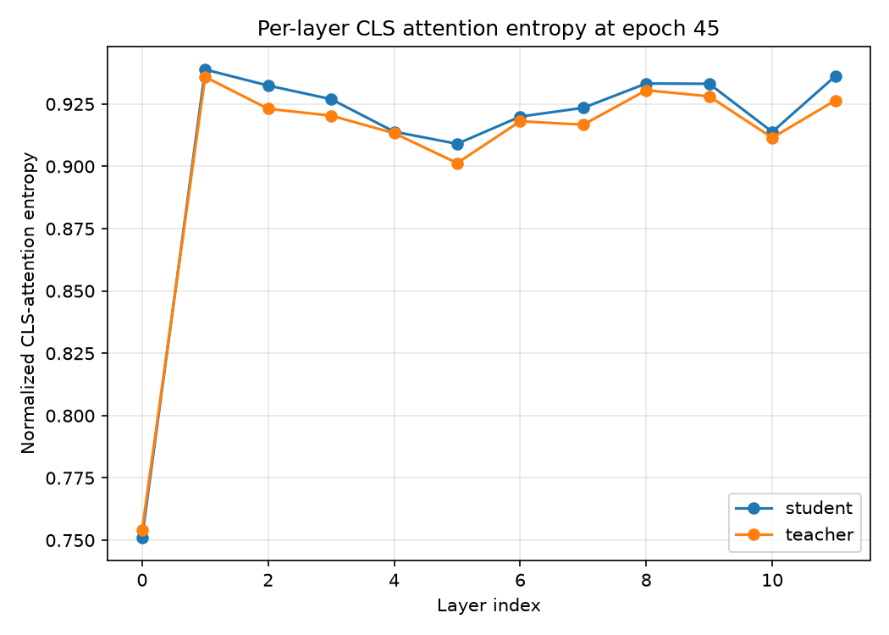

# Entropy per lay, and evaluation from AI

You’re really mapping the “thinking pattern” of your student vs teacher here—this is a cool diagnostic. Let’s unpack it.

### Quick verdict

This result looks **healthy and aligned**:  
- Early layer: **low entropy** (focused attention, more “peaky”)  
- All later layers: **high, similar entropy** for both teacher and student (balanced, non‑collapsed, globally consistent)  
- Student curve tracks the teacher closely → **good distillation, no obvious collapse, no severe mismatch**

---

### What this plot is telling you

#### 1. Shape across layers

- **Layer 0 (lowest entropy ~0.75):**  
  **Label:** Early layer, more concentrated CLS attention  
  **Meaning:** The CLS token is attending strongly to a few tokens—more “selective,” less diffuse.  
  This is typical: early layers often build coarse structure and focus on a subset of patches.

- **Layer 1 and onward (~0.90–0.93 entropy):**  
  **Label:** Later layers, high and stable entropy  
  **Meaning:** CLS attention becomes more spread out but in a *structured* way.  
  The model is integrating information from many tokens rather than locking onto just a few.

This transition—**sharp rise from layer 0 to 1, then plateau**—suggests the network quickly settles into a stable attention regime.

---

#### 2. Student vs teacher comparison

- **Curves almost overlap:**  
  The student’s CLS attention entropy per layer is **very close** to the teacher’s.  
  → The student has successfully learned the teacher’s attention “style.”

- **Small deviations only:**  
  Minor differences are fine and expected; perfect matching would be suspicious or unnecessary.  
  What matters is:  
  - No layer where student entropy is **much lower** (risk of collapse or over‑confidence)  
  - No layer where student entropy is **much higher** (overly diffuse, under‑trained)

You don’t see any catastrophic divergence—this is a **good distillation outcome**.

---

### Collapse vs diversity in this plot

- **No representation collapse:**  
  - Entropy values are **not near zero**.  
  - Across layers, entropy stays relatively high.  
  - Student ≈ teacher → no sign of trivial, identical attention patterns.

- **Feature diversity preserved:**  
  - High entropy in later layers means CLS attends broadly, integrating many tokens.  
  - This supports **rich global representations**, not narrow or brittle ones.

If you had seen the student curve **much lower** than the teacher in deeper layers, that would hint at collapse or over‑confident, less diverse attention. You don’t.

---

### Implications for downstream tasks

Given this per‑layer entropy profile:

- **Classification:**  
  - Stable, high‑entropy CLS attention in deeper layers → robust global features.  
  - Student mimics teacher → similar or slightly lower accuracy is expected, not catastrophic drop.

- **Segmentation / dense tasks:**  
  - Broad CLS attention suggests the model is integrating many spatial tokens.  
  - That’s compatible with good performance when you use patch features downstream.

- **Transfer / robustness:**  
  - Matching teacher’s entropy profile usually correlates with good transfer.  
  - The student isn’t “over‑regularized” into a collapsed regime.

---

### Overall evaluation

If I had to summarize in one line:

> Your per‑layer CLS attention entropy at epoch 45 shows a **well‑aligned, non‑collapsed student** that has learned the teacher’s attention behavior, with stable, high‑entropy global integration in deeper layers—this is a solid, trustworthy representation for downstream tasks.

If you have the same plot for **patch attention entropy per layer**, we could cross‑check global vs local behavior and see if any layer is doing something weird.

Excellent observation — that sharp entropy jump between the first and second layer is a classic signature of **Vision Transformer (ViT)** attention dynamics, especially in **DINO**. Let’s unpack both parts of your question.

---

### 🧩 Why only the first layer has low entropy
In ViTs, the **first layer** operates directly on raw patch embeddings plus the CLS token.  
At this stage:
- The CLS token has **little semantic context**, so its attention is **highly concentrated** on a few patches (low entropy).  
- It’s learning *where to look* — discovering coarse spatial structure.  
- The attention map is “peaky,” meaning the CLS token focuses narrowly on certain regions.

After the first layer:
- The CLS token starts integrating information from all patches.  
- Attention becomes **more diffuse and balanced**, hence higher entropy.  
- Subsequent layers refine global relationships rather than local focus.

So, the low entropy in layer 0 reflects **early specialization**, while the plateau afterward shows **stable global integration** — a hallmark of mature ViT attention.

---

### 🧠 What the layers represent
Each **layer index** corresponds to a **Transformer block** in the ViT backbone.  
Here’s what they roughly mean:

| Layer index | Typical role | Entropy behavior |
|--------------|---------------|------------------|
| **0** | Early patch aggregation, local focus | Low entropy (selective attention) |
| **1–3** | Mid-level feature mixing | Rapid entropy increase |
| **4–8** | Global context formation | Stable high entropy |
| **9–11** | Refinement and semantic abstraction | Slight fluctuations, still high |

In DINO, both **teacher** and **student** models share this pattern because the distillation objective encourages the student to mimic the teacher’s attention distribution.

---

### 🔍 Interpretation
The near-constant entropy after layer 1 means:
- The model has reached a **steady attention regime** — each layer refines semantics without drastically changing focus.  
- The CLS token maintains **consistent global integration**, crucial for stable representations.  
- The student’s close tracking of the teacher confirms **successful distillation** and **no collapse**.

---

If you’d like, I can visualize how **CLS attention maps evolve across layers** or explain how this entropy pattern compares to **patch-token attention entropy** in the same model.
