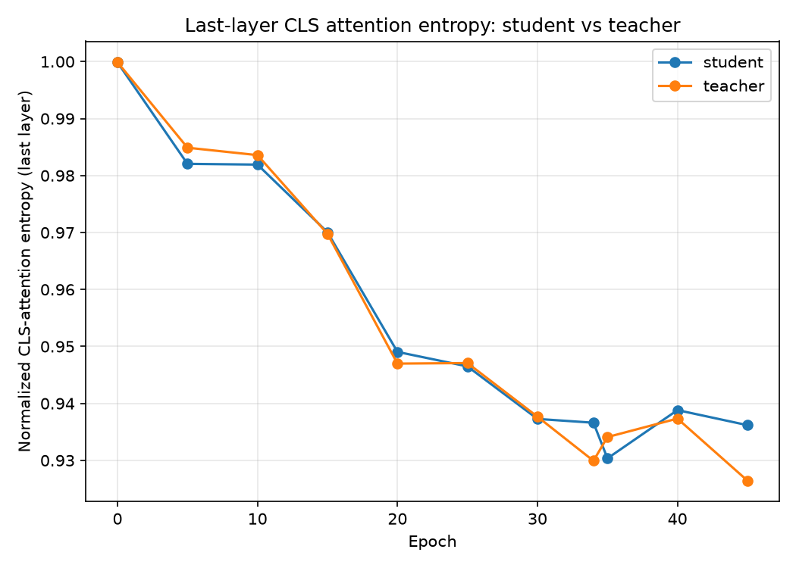
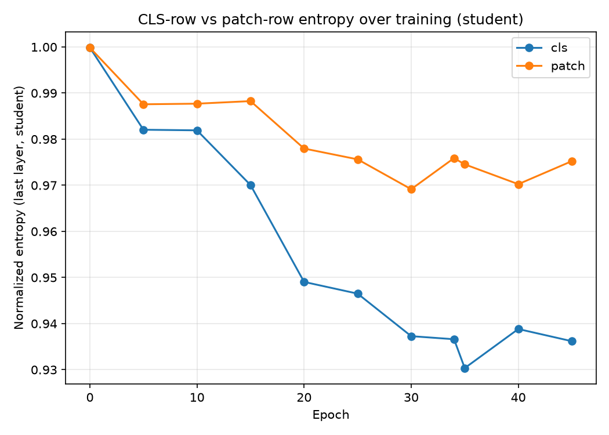

# Evaluation on the entropies on the last layer from AI

**comparison of the cls entropy between student and teacher**

**comparison of cls and patch entropies of student model**

This plot shows how the **normalized entropy** of the student model’s last layer evolves during training for two token types — the **CLS token** (blue) and **patch tokens** (orange).  

Here’s what’s happening:  

- **CLS entropy decrease**: The CLS token’s entropy drops steadily, meaning its output distribution becomes more confident and less uniform. This suggests the student’s global representation (the CLS embedding) is becoming more focused and discriminative as training progresses.  
- **Patch entropy behavior**: Patch tokens maintain higher entropy, fluctuating slightly but staying above the CLS curve. This indicates that local patch representations remain more diverse and less certain — typical for ViT-based models where patches encode fine-grained visual details.  
- **Interpretation for DINO**: In self-distillation frameworks like DINO, entropy reduction reflects the student aligning with the teacher’s confident predictions. The sharper decline for CLS implies the student is learning strong global semantics, while the slower patch entropy decay shows it retains spatial richness.  

In short, your curve is a healthy sign: the student’s **CLS token is specializing**, while **patch tokens preserve variability**, balancing global and local learning.  

The entropy trend you observed connects directly to the balance between **representation collapse** and **feature diversity** in self-supervised learning like DINO.  

### 🧠 Representation Collapse
- **Collapse risk** occurs when all embeddings become nearly identical — entropy drops too low, meaning the model outputs overly confident, uniform predictions.  
- In your curve, the **CLS entropy** decreases steadily but stabilizes above ~0.93, not near zero. That’s good — it shows the student is becoming confident without collapsing.  
- If entropy had plummeted further, it would indicate the student lost variability, producing trivial representations (e.g., same embedding for all images).  

### 🌈 Feature Diversity
- **Feature diversity** is reflected in the **patch entropy** staying higher. Each patch token captures local details, maintaining variability across spatial features.  
- This diversity prevents collapse by ensuring the model still encodes rich, multi-scale information.  
- The gap between CLS and patch entropy shows a healthy hierarchy: global features (CLS) are compact and discriminative, while local features (patches) remain expressive.  

### ⚖️ Interpretation for DINO
- DINO’s design — teacher-student with centering and temperature scaling — explicitly manages this entropy balance.  
- The **CLS entropy decline** signals convergence toward semantic consistency, while **patch entropy stability** ensures the network doesn’t lose texture-level diversity.  

In short, your entropy curves demonstrate that the student is **learning structured representations without collapsing**, maintaining **feature diversity** across spatial tokens.  

The entropy balance you’re seeing — **low‑but‑stable CLS entropy** and **higher‑but‑stable patch entropy** — has very concrete consequences for downstream tasks like **classification**, **segmentation**, **detection**, and **retrieval**.  
Here’s the direct connection.

---

### 🎯 Core takeaway  
A healthy entropy gap (CLS < patches) produces **strong global semantics** and **rich local features**, which directly improves classification accuracy, segmentation quality, and robustness across tasks.

---

## 🧠 1. Classification: why low CLS entropy helps  
The **CLS token** is the global summary of the image.  
When its entropy converges to a **lower plateau**, it means:

- The model produces **confident, sharp global embeddings**  
- Class boundaries become **cleaner and more separable**  
- Linear probes and fine‑tuned classifiers perform **better**

If CLS entropy were too high, the global representation would be noisy and ambiguous.  
If it were too low (collapse), all images would look the same.

Your curve shows the sweet spot:  
**confident but not collapsed global features → strong classification performance.**

Key concept: **CLS entropy decrease**

---

## 🎨 2. Segmentation: why high patch entropy helps  
Segmentation relies on **local spatial features**, not just global semantics.

Higher patch entropy means:

- Patch tokens retain **diverse, fine‑grained information**  
- Boundaries between objects remain **sharp**  
- Texture, edges, and shapes are **well‑preserved**  
- Pixel‑level predictions become **more accurate**

If patch entropy collapsed toward CLS entropy, segmentation would suffer:

- All patches would encode similar features  
- Object boundaries would blur  
- Fine structures would disappear

Your patch entropy plateau shows the model maintains **feature diversity**, which is essential for segmentation.

Key concept: **Patch entropy behavior**

---

## 🧩 3. Detection & localization: the entropy gap matters  
Object detection needs both:

- **Global context** (CLS)  
- **Local cues** (patches)

The entropy gap ensures:

- CLS token → stable global context  
- Patch tokens → rich spatial detail  

This balance improves:

- Bounding box localization  
- Multi‑object separation  
- Small object detection  
- Robustness to clutter

If both entropies converged to the same low value → collapse → detectors fail.

---

## 🔍 4. Retrieval & similarity search  
Low CLS entropy → embeddings cluster meaningfully  
High patch entropy → intra‑class variation is preserved

This improves:

- Image retrieval  
- Nearest‑neighbor search  
- Clustering  
- Zero‑shot transfer

Collapsed entropy would make all embeddings nearly identical → retrieval breaks.

---

## 🧬 5. Representation collapse vs. feature diversity  
Your entropy curves show:

- **No collapse** (CLS entropy > 0, patch entropy > CLS)  
- **Healthy diversity** (patch entropy stable and higher)

This balance is exactly what DINO is designed to produce.

Key concept: **Representation collapse**  
Key concept: **Feature diversity**

---

## 📌 Summary table

| Aspect | Low CLS Entropy | High Patch Entropy |
|-------|------------------|--------------------|
| **Classification** | Strong global semantics | — |
| **Segmentation** | — | Rich spatial detail |
| **Detection** | Context | Localization cues |
| **Retrieval** | Clean clusters | Preserved variation |
| **Collapse risk** | Low if entropy > 0 | Very low if entropy stays high |

---

## 🔧 If you want to go deeper  
You can explore:

- **Downstream linear probe behavior**  
- **Teacher vs student entropy alignment**  
- **How temperature scaling shapes entropy**  

Just tell me which direction you want to dive into.

Yes — both curves **converge**, and that convergence is exactly what you *want* to see in a stable DINO-style self‑supervised model.  
Here’s the deeper meaning, especially regarding **representation collapse** and **feature diversity**.

---

### 🧩 What “convergence” means in this entropy plot
Both the **CLS entropy** and **patch entropy** settle into stable plateaus.  
But *what* they converge to — and *how far apart* they remain — is the key.

- **CLS entropy converges to a lower value**  
  → The global representation becomes confident and sharp.  
  → The model has learned stable semantic structure.

- **Patch entropy converges to a higher value**  
  → Local features remain diverse and expressive.  
  → The model preserves spatial richness.

The fact that both curves flatten means the model has reached a **steady representational regime**.

---

### 🧠 How convergence relates to representation collapse
Representation collapse happens when entropy → 0 and all outputs become identical.

Your curves **do not collapse** because:

- The CLS entropy converges **above zero**, not toward a trivial distribution.  
- Patch entropy stays **significantly higher**, meaning the model still encodes varied local information.  
- The gap between the two curves remains **non‑zero**, showing hierarchical structure.

If collapse were happening, you’d see:

- Both curves dropping sharply toward the same very low entropy.  
- Patch entropy losing variability and merging with CLS entropy.  
- No stable plateau — instead a monotonic decline.

Your plot shows the opposite: **healthy convergence without collapse**.

---

### 🌈 How convergence relates to feature diversity
Feature diversity is preserved when:

- Patch entropy stays high → diverse local features  
- CLS entropy stays lower → compact global semantics  
- Both stabilize → the model has learned a consistent balance

This is exactly what DINO aims for:  
**a confident global token + diverse patch tokens**.

If diversity were lost, patch entropy would collapse downward and converge to the CLS curve.

---

### 🔍 Why both curves converge but remain separated
This separation is the signature of a **non‑collapsed, well‑trained DINO model**:

- The student aligns with the teacher (entropy decreases).  
- But centering + temperature prevent collapse (entropy stays above a threshold).  
- Patch tokens maintain variability (higher entropy plateau).  

Convergence simply means training has stabilized — not that features have collapsed.

---

### 📌 Summary
- **Convergence = stable learning**, not collapse.  
- **CLS entropy low & stable = strong global semantics.**  
- **Patch entropy higher & stable = preserved feature diversity.**  
- **Gap between curves = healthy hierarchical representation.**

---

If you want, I can also analyze how this entropy plateau affects **downstream performance** or help you interpret **teacher vs student entropy**.
