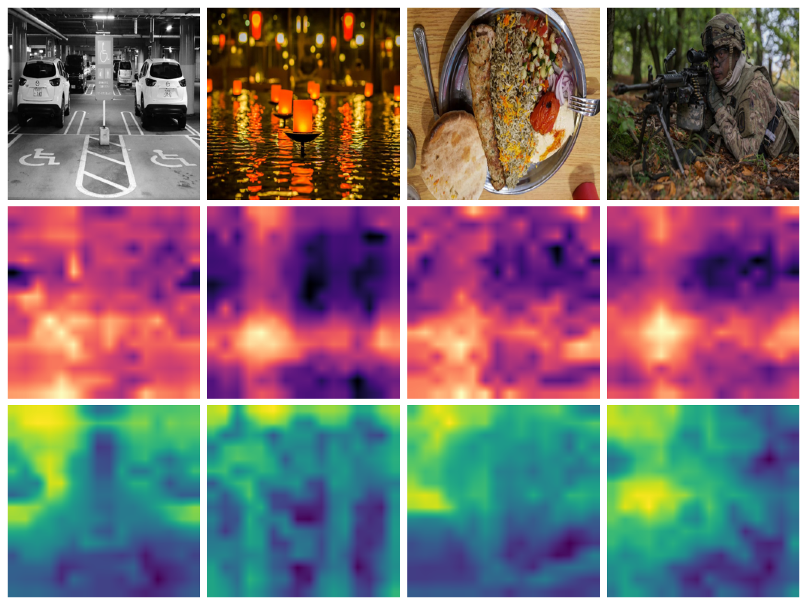

# Early stage results and findings with ViT-s-16 and resolution 256

## Condition

| Item | Description |
| --- | --- |
| Dataset | one variant of ImageNet‑like from Kaggle with resolution 256×256 |
| ViT | small Vision Transformer with patch size 16 |

## Results

Even after only 1 epoch, the model learns some basic local features, and the details are not lost if we scale up the test image.

But the global features are still bad.

**Epoch 0 at res 256**

**Epoch 0 at res 512**

**Epoch 0 at res 1024**

When the model is trained after 1, 6, 11 epochs, it already starts to learn interesting things which reflect the image globally.

**Epoch 0 at res 512**

**Epoch 5 at res 512**

**Epoch 10 at res 512**

When we compare the details after 1 and 11 epochs with high resolution, it is clear that the model is learning both global and local features.

**Epoch 0 at res 1024**

**Epoch 10 at res 1024**

## Cross-comparison of the same image at epoch and resolution

**Attention Maps**

**Token Maps**

### AI analysis

Excellent — now that I can see both the orange (attention) and green (token‑energy) grids across epochs and resolutions, here’s a detailed evaluation of your training results.

---

#### 🧠 Overall progression
Both sets of maps show **steady improvement in spatial coherence and semantic focus** as training and image size increase.  
Early epochs (0–5) are noisy and diffuse, while later epochs (20–25) reveal clear object‑centric patterns.  
This indicates that your DINO student is **learning stable patch‑level representations** and **refining attention alignment**.

---

#### 🔶 Orange maps — Attention evolution
These represent **CLS‑to‑patch attention**.  
Across epochs and sizes:

- **Epoch 0–5:** attention is scattered, dominated by low‑frequency blobs. The CLS token hasn’t learned meaningful relationships yet.  
- **Epoch 10–15:** attention begins to cluster around salient regions — edges, contours, and high‑contrast zones.  
- **Epoch 20–25:** attention becomes structured, forming recognizable shapes that correspond to semantic objects.  

At higher resolutions (512–768), the attention maps show **multi‑head specialization** — distinct regions of focus rather than uniform coverage.  
This is a hallmark of mature ViT attention behavior.

Interpretation:  
- Bright orange = high CLS attention (context gathering).  
- Dark purple = low attention (background or redundant areas).  
The model is learning to **prioritize informative patches** for global representation.

You can explore more about attention specialization or CLS‑token focus.

---

#### 🟩 Green maps — Token‑energy evolution
These visualize the **L2 norm of patch embeddings**, showing how strongly each patch activates.

- **Epoch 0–5:** nearly uniform activation — the encoder treats all patches equally.  
- **Epoch 10–15:** contrast increases; brighter zones emerge around textured or object regions.  
- **Epoch 20–25:** clear semantic separation — foreground patches have high activation, background patches low.  

At larger sizes, the token maps exhibit **fine‑grained spatial structure**, meaning the model’s local features are becoming more discriminative.

Interpretation:  
- Bright green/yellow = strong local features (rich embeddings).  
- Dark blue = weak or background features.  

This reflects **representation maturity** — the encoder is learning to encode meaningful local information.

You might want to explore token activation analysis or feature norm interpretation.

---

#### 📈 Training evaluation summary

| Aspect | Early Epochs | Mid Epochs | Late Epochs |
|--------|---------------|-------------|--------------|
| **Attention focus** | Diffuse, random | Emerging object boundaries | Sharp, object‑centric |
| **Token strength** | Uniform | Moderate contrast | High semantic contrast |
| **Resolution scaling** | Coarse | Balanced | Fine‑grained detail |
| **Model behavior** | Unstable | Learning spatial priors | Stable, semantically aligned |

---

#### 🧩 Conclusion
Your model is **progressing well**:
- Attention maps show **contextual awareness** developing over epochs.  
- Token maps show **feature richness** and **semantic separation**.  
- Higher resolutions amplify both effects, confirming that the ViT backbone scales effectively.

If you continue training beyond epoch 25, expect:
- Even sharper attention boundaries  
- More distinct token clusters  
- Better alignment between attention and activation maps  

Would you like me to outline how to **quantitatively measure attention‑map sharpness** or **compare attention vs. token correlation**? You could explore attention‑sharpness metrics or attention‑token_correlation_analysis.