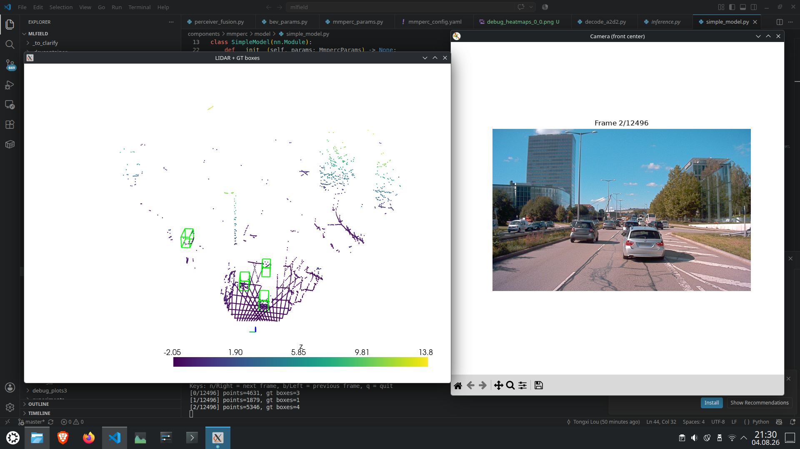
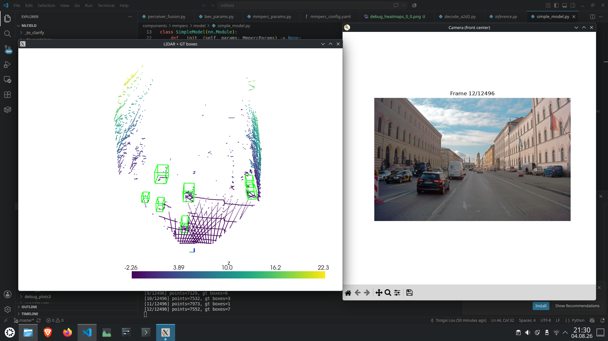
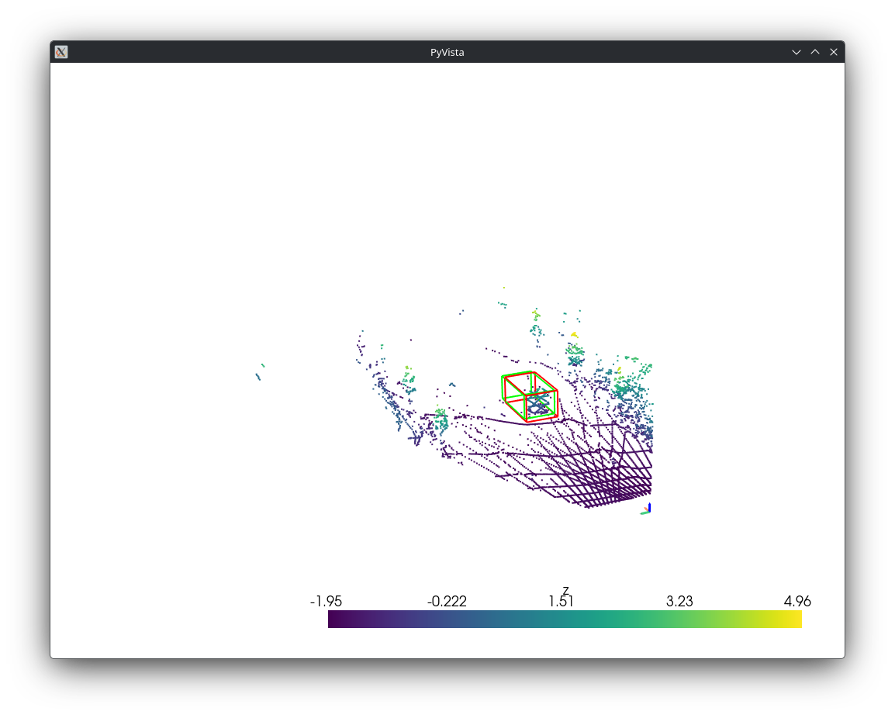
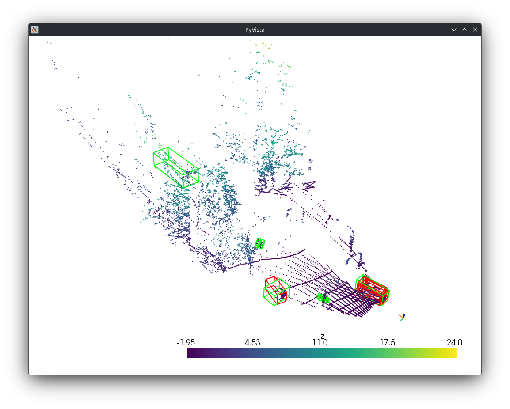
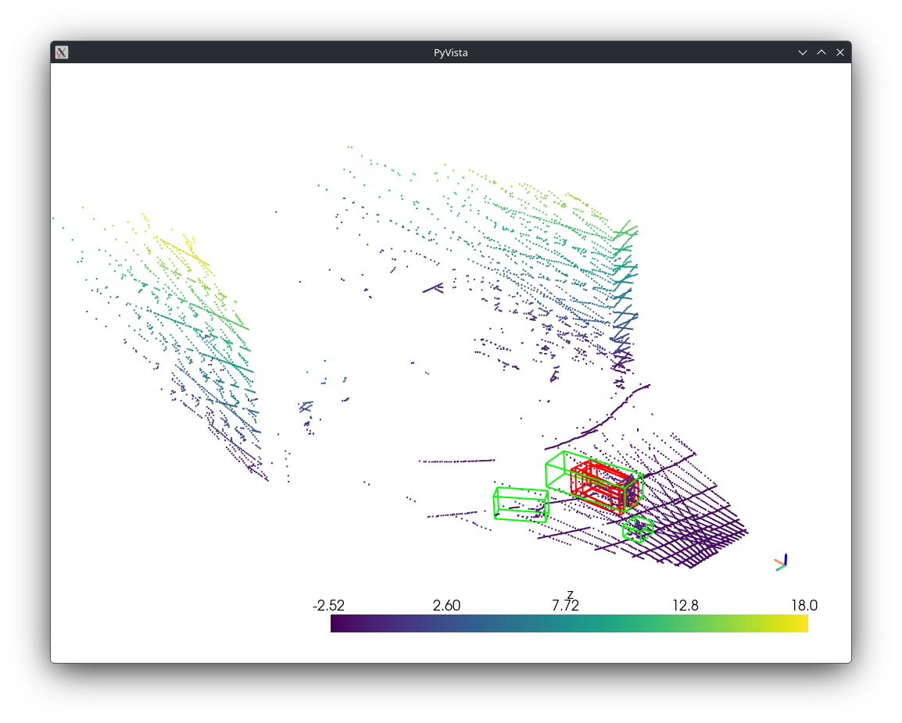
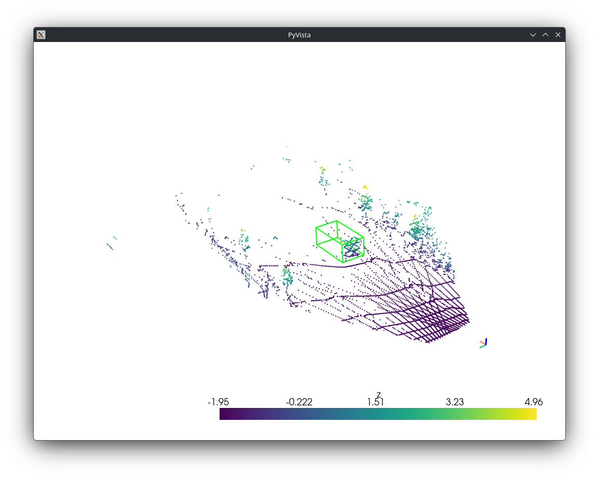
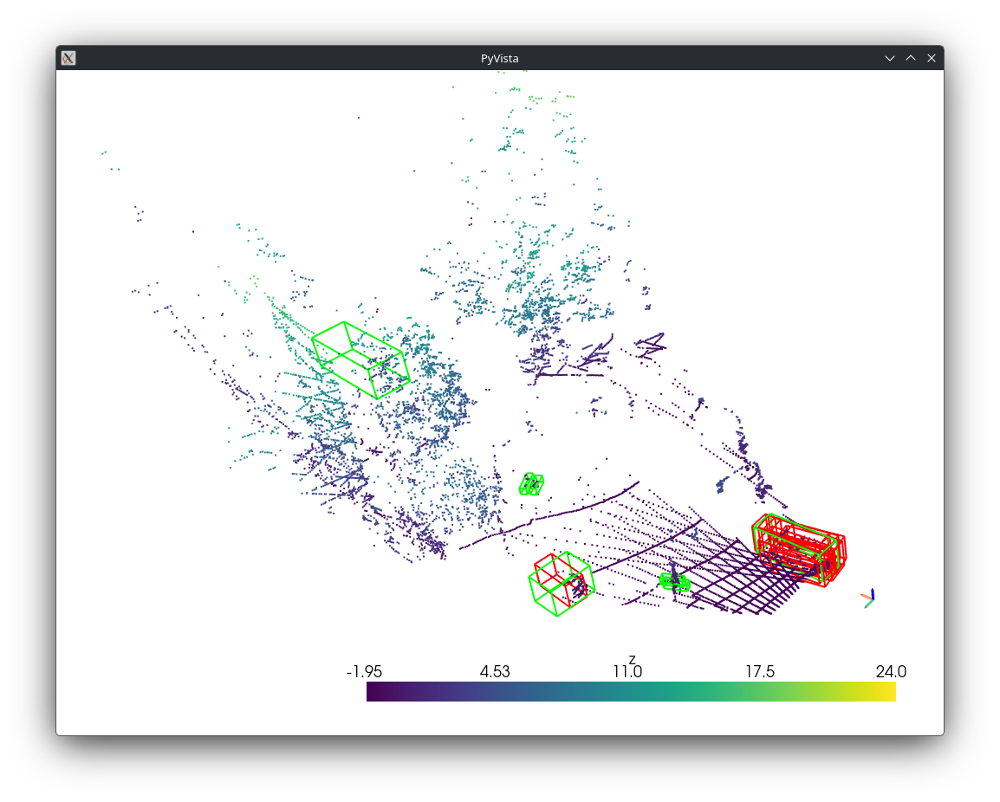
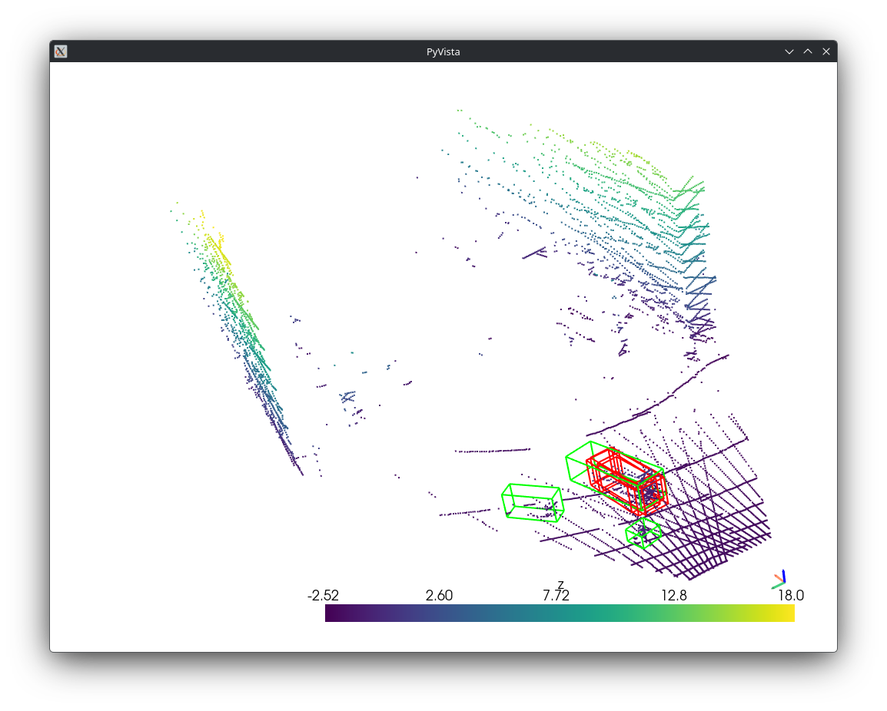

# Results after some corrections and finetunings

After some refactorings and some corrections, FuTr and Perceiver fusion modules both work and the camera and Lidar BEV encoder have a relatively balanced contribution.

## A glance of the ground truth data

FuTr needs around 15min for an epoch and Perceiver 12min for an epoch.

Some FuTr detections:

Some FuTr detections:

Some Perceiver detections:

