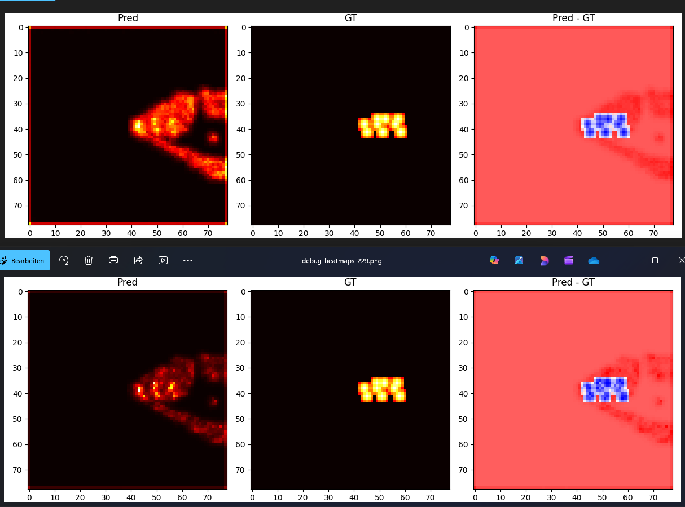

# Milestone: Multi‑Modal Single‑Task BEV Detector

This milestone introduces a **multi‑modal BEV detection network** built collaboratively with Copilot.  
The model fuses **LiDAR** and **camera** information to predict **3D bounding boxes** in the A2D2 dataset.

---

## 📥 Inputs

- **LiDAR point cloud** (single sensor)
- **RGB camera image** (single sensor)

---

## 📤 Output

- **3D bounding box predictions** in A2D2 format  
  (center, size, yaw)

---

## 🧱 Model Architecture

The system follows a simple but extensible design:

- **LiDAR encoder** → BEV feature map  
- **Camera encoder** → token embeddings  
- **Cross‑modal fusion** (FuTr‑style attention)  
- **Detection heads** → heatmap + regression

---

## 🔥 Heatmap Evolution

Training was performed on the **A2D2‑preview** subset (10 frames).  
Below is a comparison between an early epoch and epoch 50, showing how the predicted heatmap becomes sharper and more aligned with the ground truth.

---

## 🚀 Next Steps

### Experiments
- Compare **multi‑modal** vs **LiDAR‑only** vs **camera‑only**
- Add a second task (e.g., depth, semantic map, velocity)

### Engineering Improvements
- Switch to the **full A2D2 dataset** (with optional frame filtering)
- Improve and unify the data loader
- Make the model **fully configurable** (modality, backbone, stride, etc.)

---

If you want, I can help you turn this into a more formal project README with installation instructions, training commands, diagrams, and a roadmap.