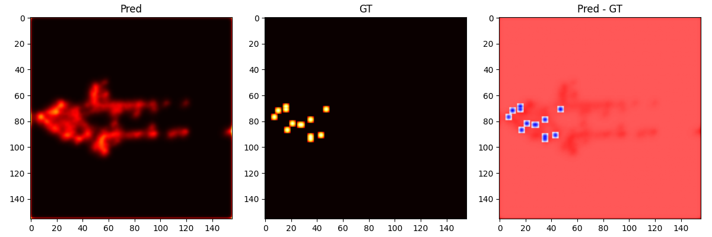
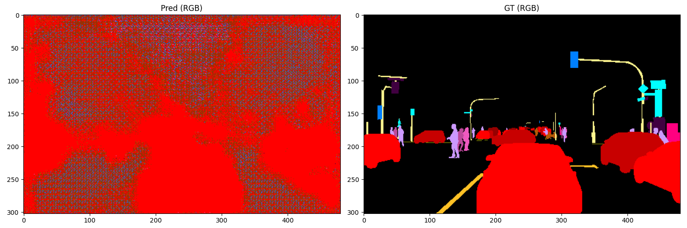

🧠 Milestone Report: Multi-Task Learning Progress

🎯 Objective

Demonstrate that the multi-task model is successfully learning both 2D bounding box detection in BEV space and semantic segmentation from camera input.

📦 Dataset Setup

Source: A2D2 NPZ chunks

Inputs:

LiDAR point clouds

PNG-encoded RGB camera images

Semantic segmentation maps (class ID per pixel)

3D bounding boxes (converted to 2D BEV targets)

Outputs:

bbox_heatmap: object center heatmap in BEV

bbox_reg: regression offsets in BEV

sem_logits: semantic logits in image space

🧪 Training Configuration

Batch size: 2

Losses:

Focal loss for heatmap prediction

L1 loss for regression

Cross-entropy for semantic segmentation

Semantic loss scaling: default (λ = 1.0)

📊 Results

✅ Semantic Segmentation Debug

GT RGB: Clean, structured segmentation maps with distinct object classes (vehicles, poles, pedestrians, signs).

Pred RGB:

Initial batches: noisy, unstructured predictions

Later batches: emergence of dominant class regions (e.g. red and blue blobs)

No checkerboard artifacts observed

✅ BEV Heatmap Debug

GT Heatmap: Sparse, localized activations centered on object locations

Pred Heatmap:

Early: large, diffuse blobs indicating over-prediction

Later: tighter clusters forming near GT centers

Difference maps show clear error regions, confirming learning signal

🔍 Observations

Semantic head is receiving gradient signal and beginning to learn class structure

BEV detection head shows spatial awareness and object localization

No signs of architectural misalignment (e.g. checkerboard effect, flipped axes)

Debug visualizations confirm correct mapping and loss propagation

Bounding box heatmap in the second epoch (200 samples):

Predicted semantics vs Ground truth in the second epoch (200 samples):

📌 Next Steps

Increase semantic loss weight (λ_sem = 2.0–5.0) to accelerate segmentation learning

Add per-class weighting or focal loss to handle class imbalance

Overlay semantic predictions on camera images for alignment checks

Track semantic IoU and pixel accuracy over time

🏁 Conclusion

The multi-task architecture is functioning as intended. Both heads are producing meaningful outputs, and debug visualizations confirm that learning is progressing. This milestone validates the joint training setup and paves the way for further refinement.

Generated on: 2026-01-24Location: Munich, Germany

